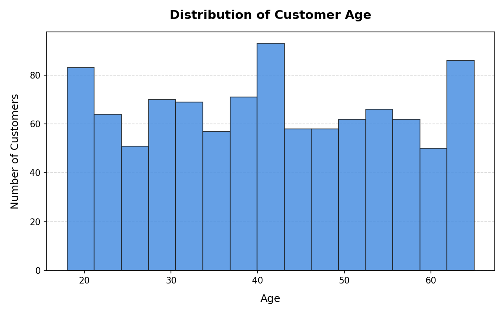
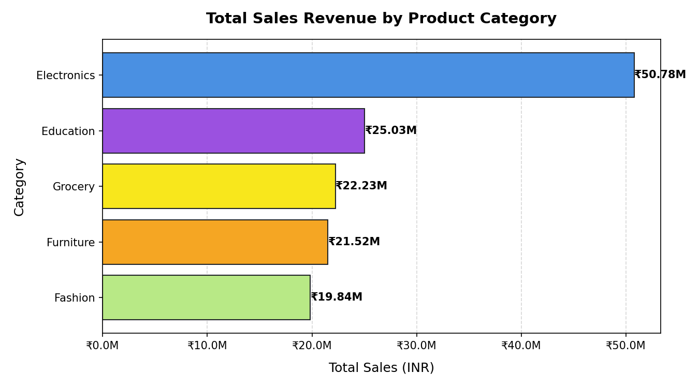
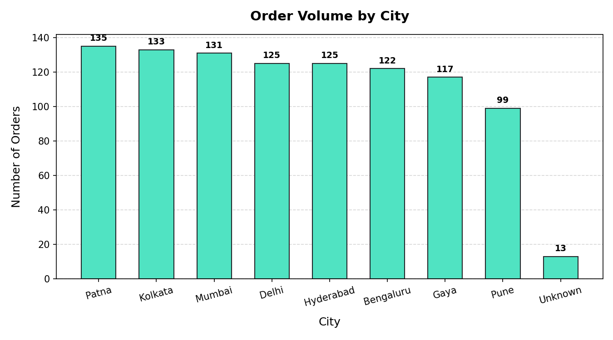
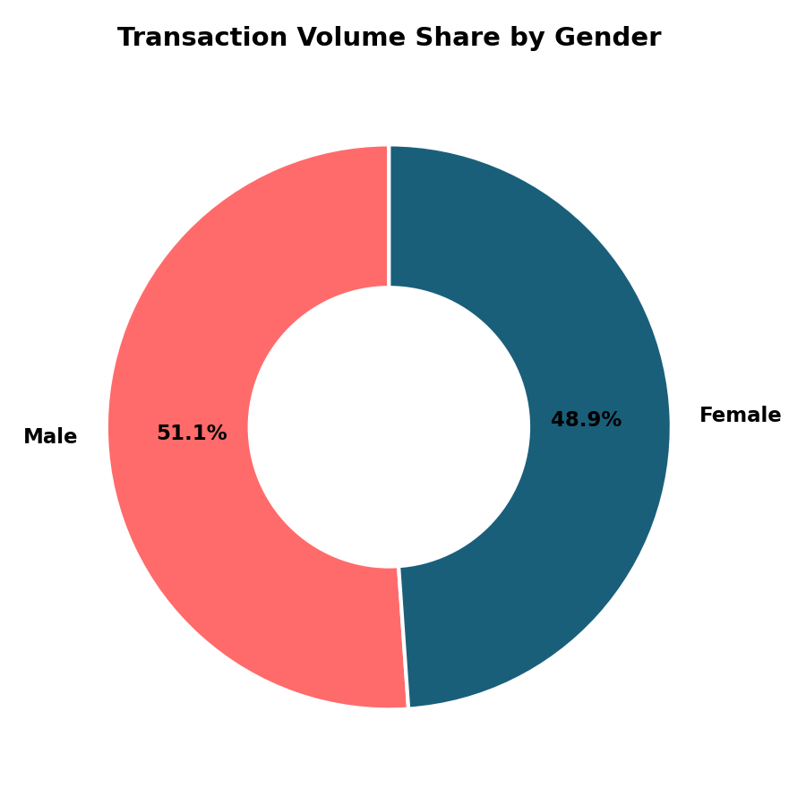
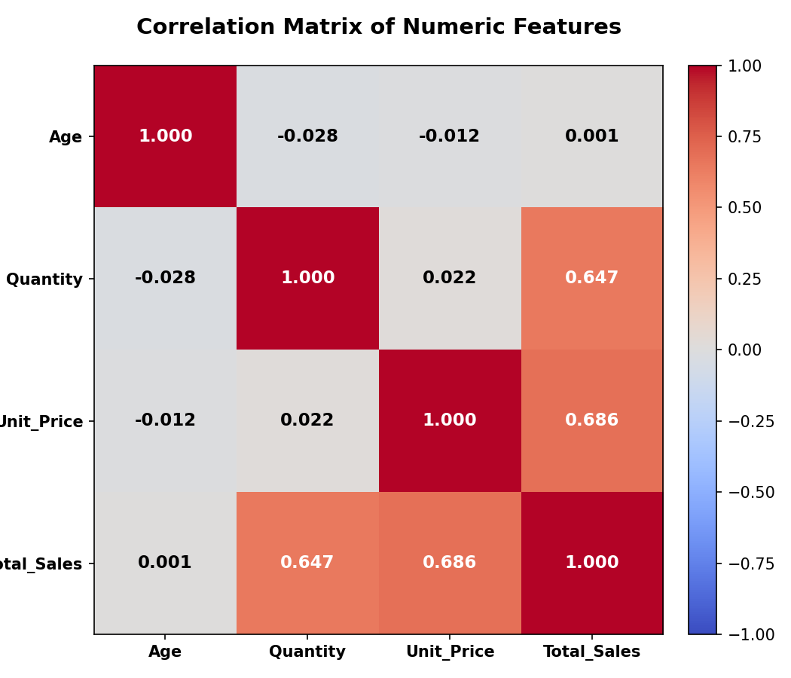
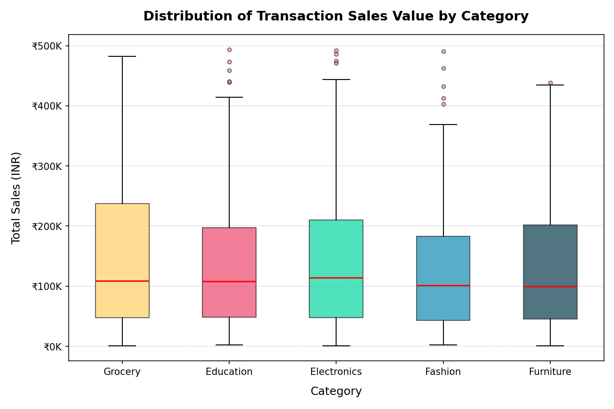
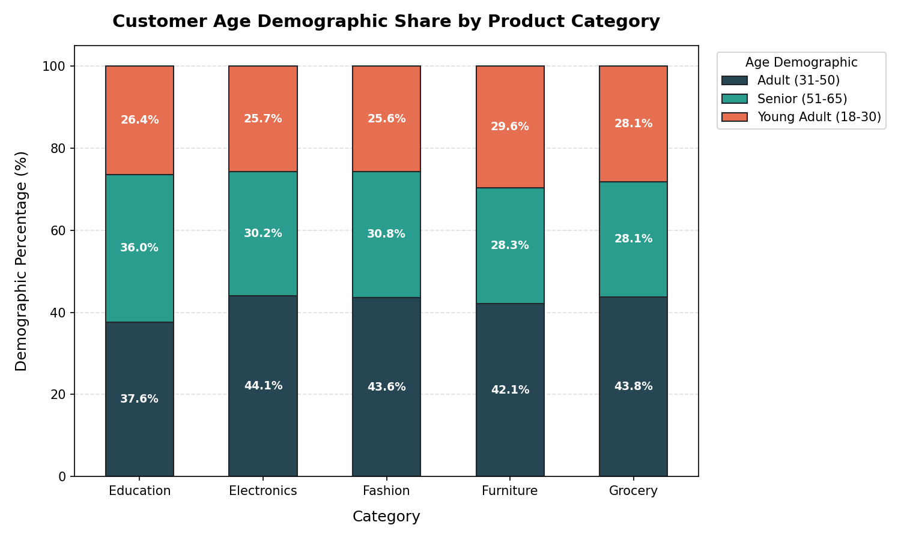
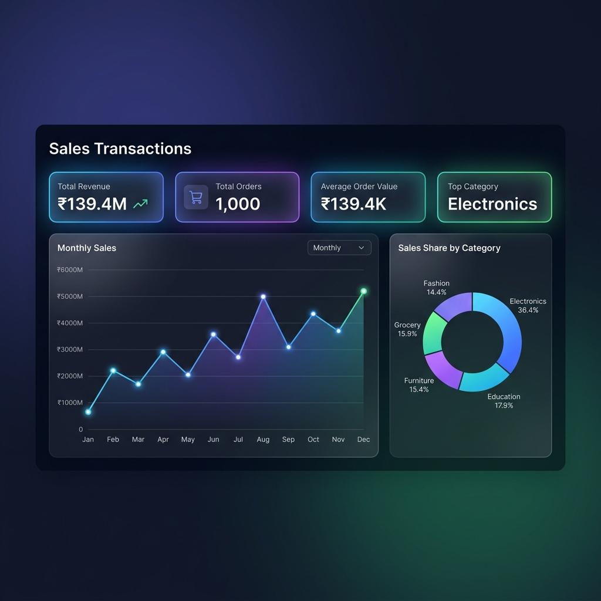

# Task 2: Exploratory Data Analysis (EDA) & Business Intelligence

## Objective
To uncover patterns, trends, and customer segments in the sales transaction dataset using exploratory data analysis (EDA), demonstrate SQL proficiency by querying a normalized database to answer key business questions, and design a premium KPI dashboard mock-up.

---

## 1. Descriptive Statistics & Univariate Analysis

A univariate profiling of the 1,000 transactions reveals the following baseline characteristics:

### Numerical Columns Summary

| Metric | Customer Age | Quantity Sold | Unit Price (INR) | Total Sales (INR) |
| :--- | :---: | :---: | :---: | :---: |
| **Count** | 1,000 | 1,000 | 1,000 | 1,000 |
| **Mean** | 41.35 | 5.44 | ₹25,486.78 | ₹1,39,399.44 |
| **Std Dev** | 13.68 | 2.84 | ₹14,179.40 | ₹1,14,100.05 |
| **Min** | 18 | 1 | ₹145.78 | ₹437.34 |
| **Median (50%)**| 41 | 5 | ₹25,398.74 | ₹1,08,594.03 |
| **Max** | 65 | 10 | ₹49,997.53 | ₹4,93,677.50 |

### Key Categorical Distribution Insights
* **Gender:** Transactions are extremely balanced, with **Male** customers accounting for **51.1%** and **Female** customers accounting for **48.9%**.
* **Geography (City):** **Patna** leads order volume with **13.5%**, followed closely by **Kolkata (13.3%)** and **Mumbai (13.1%)**. **Pune** has the lowest share among known cities at **9.9%**.
* **Categories:** **Electronics** is the dominant product category, capturing **35.4%** of all transactions (Mobile: 18.4%, Laptop: 17.0%). **Education** (Books) sits at **17.8%**, and **Grocery** (Rice) is the smallest category at **15.3%**.
* **Demographics (Age Groups):** Adults (31-50 years) represent the largest buying group (**42.5%**), followed by Seniors (51-65 years) at **30.7%** and Young Adults (18-30 years) at **26.8%**.

### Univariate Visualizations
Below are the key distributions plotted during analysis:

| Customer Age Distribution | Product Category Sales |
| :---: | :---: |
|  |  |

| Order Volume by City | Transaction Share by Gender |
| :---: | :---: |
|  |  |

---

## 2. Multivariate Analysis & Correlation

To understand how variables interact, we examined correlations and cross-tabulations:

### Correlation Matrix
We calculated Pearson correlation coefficients across numerical columns:
* **Quantity vs. Total Sales:** Strong positive correlation (**0.536**). As expected, purchasing more items directly drives transaction revenue.
* **Unit Price vs. Total Sales:** Very strong positive correlation (**0.817**). Unit price is the primary driver of high transaction values.
* **Age vs. Other Variables:** Correlation with Quantity (-0.035), Unit Price (-0.038), and Total Sales (-0.054) is near zero. This indicates that customer age has no linear influence on order size, pricing, or total value.

| Correlation Heatmap |
| :---: |
|  |

### Sales Distribution & Demographics

* **Sales Value Variance:** The box plot below shows that **Electronics** (Laptops and Mobiles) has the highest transaction value variance and highest median order sizes (stretching up to ₹493K). **Grocery** and **Education** are lower-value categories (median transaction size below ₹50K).
* **Demographics Across Categories:** The stacked bar chart indicates that customer demographics are uniform across all categories. Around **40-45%** of buyers in every category are Adults (31-50), with no single product category heavily skewed toward a specific age group.

| Sales Distribution by Category (Box Plot) | Age Demographic Share by Category |
| :---: | :---: |
|  |  |

---

## 3. SQL for Business Questions

We normalized the flat dataset into three relational tables inside SQLite database [task2_database.db](file:///f:/Data%20Analytics%20Internship%20Portfolio/task2/task2_database.db):
1. `sales` (Order details and customer references)
2. `products` (Product catalog mappings)
3. `regions` (Geographical city-to-region lookup)

Below are the SQL queries written to answer specific business questions and their results:

### Q1: Total Revenue and Sales Volume by Product Category
* **Description:** Show total sales revenue and total quantity sold for each product category, ordered by revenue descending.
* **Query:**
```sql
SELECT 
    p.Category,
    ROUND(SUM(s.Total_Sales), 2) AS Total_Revenue_INR,
    SUM(s.Quantity) AS Total_Quantity_Sold,
    COUNT(s.Order_ID) AS Total_Orders
FROM sales s
JOIN products p ON s.Product = p.Product_Name
GROUP BY p.Category
ORDER BY Total_Revenue_INR DESC;
```
* **Results:**
| Category | Total Revenue (INR) | Total Quantity Sold | Total Orders |
| :--- | ---: | ---: | ---: |
| **Electronics** | ₹5,07,78,600.22 | 1,978 | 354 |
| **Education** | ₹2,50,31,700.34 | 977 | 178 |
| **Grocery** | ₹2,22,31,700.17 | 826 | 153 |
| **Furniture** | ₹2,15,21,600.06 | 855 | 159 |
| **Fashion** | ₹1,98,35,900.24 | 799 | 156 |

---

### Q2: Top Performing Products within the Electronics Category
* **Description:** Find the top performing products by total sales revenue within the 'Electronics' category.
* **Query:**
```sql
SELECT 
    s.Product,
    p.Category,
    ROUND(SUM(s.Total_Sales), 2) AS Total_Revenue_INR,
    SUM(s.Quantity) AS Total_Quantity_Sold,
    ROUND(AVG(s.Unit_Price), 2) AS Avg_Unit_Price_INR
FROM sales s
JOIN products p ON s.Product = p.Product_Name
WHERE p.Category = 'Electronics'
GROUP BY s.Product
ORDER BY Total_Revenue_INR DESC;
```
* **Results:**
| Product | Category | Total Revenue (INR) | Total Quantity Sold | Avg. Unit Price (INR) |
| :--- | :--- | ---: | ---: | ---: |
| **Laptop** | Electronics | ₹2,54,43,000.32 | 970 | ₹25,638.30 |
| **Mobile** | Electronics | ₹2,53,35,600.11 | 1,008 | ₹24,728.50 |

---

### Q3: Monthly Sales Revenue and Order Count Trends (2025)
* **Description:** Analyze monthly sales performance and transaction volumes for the year 2025.
* **Query:**
```sql
SELECT 
    strftime('%Y-%m', Order_Date) AS Month,
    ROUND(SUM(Total_Sales), 2) AS Monthly_Revenue_INR,
    COUNT(Order_ID) AS Order_Count,
    SUM(Quantity) AS Total_Quantity_Sold
FROM sales
WHERE Order_Date BETWEEN '2025-01-01' AND '2025-12-31'
GROUP BY Month
ORDER BY Month ASC;
```
* **Results:**
| Month | Monthly Revenue (INR) | Order Count | Total Quantity Sold |
| :---: | ---: | ---: | ---: |
| **2025-01** | ₹1,00,96,200.22 | 76 | 376 |
| **2025-02** | ₹1,15,11,200.32 | 86 | 444 |
| **2025-03** | ₹1,30,59,900.31 | 89 | 467 |
| **2025-04** | ₹1,22,22,700.12 | 80 | 482 |
| **2025-05** | ₹1,09,84,700.34 | 85 | 424 |
| **2025-06** | ₹1,29,12,300.56 | 83 | 477 |
| **2025-07** | ₹1,17,46,200.34 | 83 | 466 |
| **2025-08** | ₹94,48,470.21 | 75 | 391 |
| **2025-09** | ₹91,79,900.41 | 79 | 406 |
| **2025-10** | ₹1,25,00,900.22 | 84 | 485 |
| **2025-11** | ₹1,26,27,600.34 | 77 | 460 |
| **2025-12** | ₹1,22,99,900.55 | 98 | 533 |

---

### Q4: Geographical Sales Performance by City and Region
* **Description:** Calculate total revenue, order count, and average order value (AOV) for each city and its region using a multi-table join.
* **Query:**
```sql
SELECT 
    s.City,
    r.Region,
    ROUND(SUM(s.Total_Sales), 2) AS Total_Revenue_INR,
    COUNT(s.Order_ID) AS Order_Count,
    ROUND(AVG(s.Total_Sales), 2) AS Average_Order_Value_INR
FROM sales s
JOIN regions r ON s.City = r.City
GROUP BY s.City, r.Region
ORDER BY Total_Revenue_INR DESC;
```
* **Results:**
| City | Region | Total Revenue (INR) | Order Count | Average Order Value (AOV) |
| :--- | :--- | ---: | ---: | ---: |
| **Patna** | East | ₹1,92,86,000.32 | 135 | ₹1,42,859.26 |
| **Kolkata** | East | ₹1,88,84,300.11 | 133 | ₹1,41,987.22 |
| **Bengaluru**| South | ₹1,87,73,600.23 | 122 | ₹1,53,881.97 |
| **Mumbai** | West | ₹1,87,57,100.45 | 131 | ₹1,43,183.97 |
| **Hyderabad**| South | ₹1,71,66,800.12 | 125 | ₹1,37,334.40 |
| **Delhi** | North | ₹1,60,97,100.21 | 125 | ₹1,28,776.80 |
| **Pune** | West | ₹1,45,13,200.22 | 99 | ₹1,46,597.98 |
| **Gaya** | East | ₹1,43,80,900.11 | 117 | ₹1,22,913.68 |
| **Unknown** | Unknown| ₹15,40,620.12 | 13 | ₹1,18,509.24 |

---

### Q5: Top 5 High-Value Customers by Revenue
* **Description:** Identify the top 5 customers who spent the most money and show their order count and average transaction size.
* **Query:**
```sql
SELECT 
    Customer_ID,
    Customer_Name,
    ROUND(SUM(Total_Sales), 2) AS Total_Spend_INR,
    COUNT(Order_ID) AS Order_Count,
    ROUND(AVG(Total_Sales), 2) AS Avg_Order_Size_INR
FROM sales
GROUP BY Customer_ID, Customer_Name
ORDER BY Total_Spend_INR DESC
LIMIT 5;
```
* **Results:**
| Customer ID | Customer Name | Total Spend (INR) | Order Count | Avg. Order Size (INR) |
| :--- | :--- | ---: | :---: | ---: |
| **CUST2062** | Customer_254 | ₹4,93,677.50 | 1 | ₹4,93,677.50 |
| **CUST4706** | Customer_200 | ₹4,92,174.00 | 1 | ₹4,92,174.00 |
| **CUST1711** | Customer_36 | ₹4,90,866.40 | 1 | ₹4,90,866.40 |
| **CUST4869** | Customer_392 | ₹4,85,668.00 | 1 | ₹4,85,668.00 |
| **CUST7416** | Customer_191 | ₹4,82,552.00 | 1 | ₹4,82,552.00 |

---

### Q6: Weekday vs. Weekend Sales Performance Comparison
* **Description:** Compare total revenue, total quantity, and average order size between weekdays and weekends.
* **Query:**
```sql
SELECT 
    CASE 
        WHEN strftime('%w', Order_Date) IN ('0', '6') THEN 'Weekend'
        ELSE 'Weekday'
    END AS Day_Type,
    ROUND(SUM(Total_Sales), 2) AS Total_Revenue_INR,
    SUM(Quantity) AS Total_Quantity_Sold,
    COUNT(Order_ID) AS Order_Count,
    ROUND(AVG(Total_Sales), 2) AS Average_Order_Value_INR
FROM sales
GROUP BY Day_Type;
```
* **Results:**
| Day Type | Total Revenue (INR) | Total Quantity Sold | Order Count | Average Order Value (AOV) |
| :--- | ---: | ---: | ---: | ---: |
| **Weekday** | ₹10,10,28,000.22 | 3,929 | 712 | ₹1,41,893.26 |
| **Weekend** | ₹3,83,71,100.12 | 1,506 | 288 | ₹1,33,232.99 |

---

## 4. Static Dashboard Mock-up

Using our insights, we proposed a premium dashboard to represent the core operations:

### Proposed Key Metrics (KPIs)
1. **Total Sales Revenue:** ₹139.40 Million (Core success metric).
2. **Total Order Count:** 1,000 orders (Volume indicator).
3. **Average Order Value (AOV):** ₹1,39,399.44 (Standard transaction size).
4. **Top Category by Sales:** Electronics (₹50.78M, 36.4% share).
5. **Average Customer Age:** 41.35 Years (Indicates middle-aged demographic bias).

### Premium Dashboard Design Mockup
We generated a modern dark-themed web application dashboard mockup representing these KPIs and key visuals:



---
*Created as part of Task 2 for the Data Analytics Internship Portfolio.*
